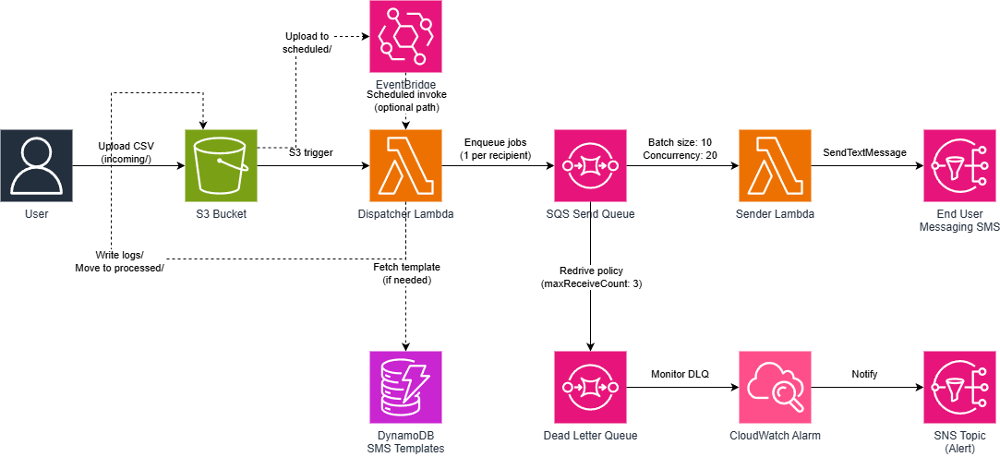

# CSV Bulk SMS Sender and Scheduler

A serverless solution for sending bulk SMS messages from a CSV file using AWS End User Messaging. Upload a CSV of phone numbers and messages to Amazon S3, and the system automatically validates, dispatches to SQS, and sends SMS to each recipient with concurrency-controlled throughput. Includes scheduling support via EventBridge Scheduler.

## Features

- **CSV-driven sending** — Upload a CSV and SMS messages are sent automatically
- **Pre-flight CSV validation** — Headers, phone formats, and message sources are validated before any sends
- **Tiered template resolution** — Per-row messages, inline templates with `{{variables}}`, or stored DynamoDB templates
- **Campaign tracking** — Every send carries a `campaign_name` and unique `campaign_id` for analytics
- **SQS fan-out architecture** — Dispatcher validates and queues; Sender processes with concurrency control
- **Dead-letter queue** — Failed sends land in a DLQ with optional CloudWatch alarm notifications
- **Scheduling options** — Immediate send via S3 trigger or scheduled via EventBridge Scheduler
- **Automatic logging** — Dispatch results written to S3 as plain-text log files
- **File lifecycle management** — Processed CSVs are moved from `incoming/` to `processed/` automatically

## Architecture



## Prerequisites

- An active AWS account with AWS End User Messaging configured
- A registered origination identity (10DLC, toll-free, or short code) approved for sending
- [AWS SAM CLI](https://docs.aws.amazon.com/serverless-application-model/latest/developerguide/install-sam-cli.html) installed
- AWS CLI configured with credentials
- Python 3.12 runtime for Lambda

## Quick Start (SAM Deployment)

The SAM template deploys everything: S3 bucket, Dispatcher Lambda, Sender Lambda, SQS queue, DLQ, DynamoDB template table, IAM roles, S3 event trigger, and EventBridge Scheduler role.

```bash
# Build
sam build

# Deploy (first time — interactive)
sam deploy --guided

# Deploy (subsequent — uses saved config)
sam build && sam deploy
```

Key parameters:

| Parameter | Default | Description |
|---|---|---|
| `StackPrefix` | `BulkSmsSender` | Prefix for resource names — change for multi-stack deploys |
| `OriginationIdentity` | (none) | Your sending phone number or ARN |
| `MessageType` | `TRANSACTIONAL` | `TRANSACTIONAL` or `PROMOTIONAL` |
| `SenderConcurrency` | `20` | Max concurrent Sender Lambda invocations (controls SMS throughput) |
| `DlqAlarmEmail` | (none) | Email for DLQ alarm notifications (optional) |

### Multiple stacks for different use cases

```bash
# Marketing — toll-free, promotional, lower throughput
sam deploy --stack-name bulk-sms-marketing \
    --parameter-overrides "StackPrefix=BulkSmsMarketing OriginationIdentity=+18001234567 MessageType=PROMOTIONAL SenderConcurrency=10"

# Transactional — 10DLC, transactional, higher throughput
sam deploy --stack-name bulk-sms-transactional \
    --parameter-overrides "StackPrefix=BulkSmsTransactional OriginationIdentity=+15551234567 MessageType=TRANSACTIONAL SenderConcurrency=50"
```

## Two Ways to Send

### Immediate send (S3 trigger)

Upload a CSV to the `incoming/` prefix and it processes immediately:

```bash
aws s3 cp my-campaign.csv s3://YOUR-BUCKET/incoming/my-campaign.csv
```

When triggered by S3, the `campaign_name` is derived from the filename (e.g. `my-campaign`).

### Scheduled send (EventBridge Scheduler)

Upload a CSV to `scheduled/` (no auto-trigger), then create a one-time schedule:

```bash
# 1. Upload the CSV
aws s3 cp my-campaign.csv s3://YOUR-BUCKET/scheduled/my-campaign.csv

# 2. Create a schedule
aws scheduler create-schedule \
    --name "april-campaign" \
    --schedule-expression "at(2026-04-20T10:00:00)" \
    --schedule-expression-timezone "America/Los_Angeles" \
    --flexible-time-window Mode=OFF \
    --action-after-completion DELETE \
    --target '{
        "Arn": "YOUR-DISPATCHER-ARN",
        "RoleArn": "YOUR-SCHEDULER-ROLE-ARN",
        "Input": "{\"bucket\":\"YOUR-BUCKET\",\"key\":\"scheduled/my-campaign.csv\",\"campaign_name\":\"april-campaign\"}"
    }' \
    --region us-west-2
```

For direct invocation, `campaign_name` is required in the payload.

## Message Templates

Messages are resolved in priority order. The first match wins:

### Priority 1: Per-row `message` column in CSV

Each row has its own fully-written message. No variable substitution.

```csv
phone_number,message
+15551234567,Your appointment is confirmed for April 8.
+15559876543,Your order #4821 has shipped.
```

### Priority 2: Inline `message_template` in the request

Pass a template with `{{variable}}` placeholders in the invocation payload. CSV columns provide the values.

```json
{
    "bucket": "my-bucket",
    "key": "scheduled/appointments.csv",
    "campaign_name": "april-reminders",
    "message_template": "Hi {{name}}, your appointment is on {{appt_date}}."
}
```

```csv
phone_number,name,appt_date
+15551234567,Tyler,April 10 at 3:00 PM
+15559876543,Jordan,April 12 at 1:00 PM
```

### Priority 3: Stored DynamoDB template

Reference a template stored in the DynamoDB template table:

```json
{
    "bucket": "my-bucket",
    "key": "scheduled/appointments.csv",
    "campaign_name": "april-reminders",
    "template_id": "appointment-reminder-v1"
}
```

Create a template:

```bash
aws dynamodb put-item \
    --table-name BulkSmsSender-templates \
    --item '{
        "template_id": {"S": "appointment-reminder-v1"},
        "template_body": {"S": "Hi {{name}}, your appointment is on {{appt_date}}."},
        "description": {"S": "Standard appointment reminder"},
        "required_variables": {"SS": ["name", "appt_date"]},
        "created_at": {"S": "2026-04-17T00:00:00Z"}
    }'
```

### No message = failure

If none of the three message sources are provided, the job fails immediately with a clear error. There is no silent default fallback — this prevents accidental sends with wrong content.

## Campaign Context

Every send includes campaign metadata for analytics:

- `campaign_name` — human-readable name (required in payload, or derived from filename for S3 triggers)
- `campaign_id` — `{campaign_name}-{8-char-uuid}` generated per job execution

These are passed as the `Context` parameter on `send-text-message`, flowing through to CloudWatch and event destinations. Use them to filter delivery rates, failures, and costs per campaign.

## CSV Validation

Before any messages are queued, the Dispatcher validates:

- CSV has headers (not empty)
- `phone_number` column exists
- At least one message source is configured (per-row column, inline template, or template_id)
- If using a template, all `{{placeholder}}` variables have matching CSV columns
- Per-row: phone numbers match E.164 format, messages are not empty

If validation fails, the entire job is rejected with a detailed error log written to `logs/`.

## Throughput Control

SMS throughput is controlled by the `SenderConcurrency` parameter — the reserved concurrency on the Sender Lambda. Each Sender invocation processes up to 10 messages from SQS.

| SenderConcurrency | Approx. throughput | Use case |
|---|---|---|
| 5 | ~25 msg/sec | Low-volume, conservative |
| 20 | ~100 msg/sec | Standard workloads |
| 50 | ~250 msg/sec | High-volume campaigns |

Adjust based on your account's SMS rate limits. No code changes needed — just update the parameter and redeploy.

## Failed Message Handling

Messages that fail after 3 SQS delivery attempts land in the dead-letter queue (DLQ). If you provided a `DlqAlarmEmail` parameter, a CloudWatch alarm triggers an SNS notification when messages appear in the DLQ.

To inspect failed messages:

```bash
# Check DLQ depth
aws sqs get-queue-attributes \
    --queue-url YOUR-DLQ-URL \
    --attribute-names ApproximateNumberOfMessages

# Receive and inspect failed messages
aws sqs receive-message \
    --queue-url YOUR-DLQ-URL \
    --max-number-of-messages 10
```

## IAM Permissions

### Dispatcher Lambda

| Permission | Resource | Purpose |
|---|---|---|
| `s3:GetObject` | `incoming/*`, `scheduled/*` | Read uploaded CSV |
| `s3:PutObject` | `processed/*`, `logs/*` | Move files, write logs |
| `s3:DeleteObject` | `incoming/*`, `scheduled/*` | Remove from source after move |
| `sqs:SendMessage` | Send Queue ARN | Write send jobs to SQS |
| `dynamodb:GetItem` | Template Table ARN | Fetch stored templates |

### Sender Lambda

| Permission | Resource | Purpose |
|---|---|---|
| `sms-voice:SendTextMessage` | `*` | Send SMS via End User Messaging |

In production, scope `sms-voice:SendTextMessage` to your specific origination identity ARN with a condition key.

## Scheduling Options

The SAM template deploys EventBridge Scheduler support out of the box (IAM role included). The other options below require additional infrastructure.

### Option 1: Amazon EventBridge Scheduler (included in template)

Already deployed with the stack. Upload CSVs to `scheduled/`, create a schedule pointing to the file, and it sends at the specified time. See "Scheduled send" above for usage.

### Option 2: Amazon DynamoDB Scheduling Table

Best for managing many campaigns with cancel/reschedule capability. Requires a DynamoDB table and a poller Lambda. See the [full documentation](documentation/user-guides/bulk-sms-and-scheduling-setup-guide.md) for setup details.

### Option 3: AWS Step Functions

Best for complex workflows with approval steps and visual designer. Requires a Step Functions state machine. See the [full documentation](documentation/user-guides/bulk-sms-and-scheduling-setup-guide.md) for setup details.

## Security

### S3 Bucket Security

- Block Public Access enabled on the S3 bucket
- Default encryption (SSE-KMS) for encryption at rest
- Bucket policy enforces HTTPS-only access
- Versioning enabled to protect against accidental deletes

### IAM and Access Control

- All S3 permissions scoped to specific bucket ARN and prefixes
- SQS permissions scoped to the specific queue ARN
- DynamoDB permissions scoped to the template table ARN
- Sender Lambda has reserved concurrency to prevent runaway invocations

### Data Protection

- Phone numbers and message content are PII — treat them accordingly
- Encryption at rest on S3 (SSE-KMS), SQS (SSE-SQS), and DynamoDB
- All AWS SDK calls use HTTPS (TLS) by default for encryption in transit
- SQS messages are retained for 1 day (send queue) or 14 days (DLQ)

### Opt-Out Compliance

- AWS End User Messaging automatically handles STOP/HELP keyword responses at the carrier level
- Filter opt-out numbers before uploading your CSV
- Include opt-out instructions in message content where required by regulation

## License

This project is licensed under the MIT-0 License. See the [LICENSE](LICENSE) file.
